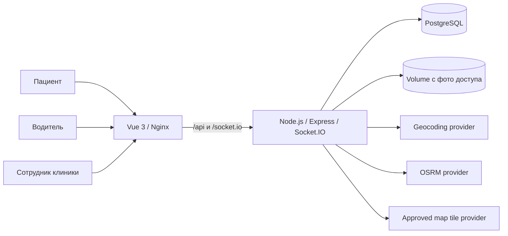

# MedTracker

MedTracker — веб-система для частных выездных медицинских служб: диспетчер создаёт вызов и назначает бригаду, водитель передаёт геопозицию и меняет этапы вызова, а пациент открывает временную ссылку и видит прибытие машины без установки приложения.

> MedTracker не заменяет государственную службу экстренной помощи, медицинскую информационную систему или сертифицированный диспетчерский комплекс. Перед эксплуатацией с реальными пациентами организация должна провести собственные проверки безопасности, доступности, правовых оснований обработки данных и аварийных процедур.

## Возможности

- изоляция клиник и ролей сотрудников;
- очередь вызовов, приоритет, назначение и переназначение бригад;
- realtime-статусы, координаты, ETA и журнал событий через Socket.IO;
- временные ссылки пациента и водителя с серверным сроком действия;
- передача симптомов, данных доступа и фотографии подъезда;
- SOS пациента с подтверждением диспетчером;
- геокодирование адреса и построение маршрута;
- публичный сайт и полевые экраны пациента/бригады на русском, казахском и английском языках;
- светлая/тёмная тема и базовая устанавливаемая web-оболочка.

## Архитектура



- `client/` — Vue 3, TypeScript, Pinia, Vue Router, Leaflet и Tailwind CSS.
- `server/` — Node.js, Express, Socket.IO, PostgreSQL и миграции.
- В production PostgreSQL обязателен. JSON/file storage оставлен только для локальной разработки.
- Миграции запускаются отдельным одноразовым сервисом `migrate`; runtime-контейнер backend получает только прикладную строку подключения к БД.
- Фото доступа хранятся отдельно от PostgreSQL в volume `medtracker-data`; резервная копия одной БД неполна.

## Роли и маршруты

| Роль | Доступ | Назначение |
|---|---|---|
| `platform_admin` | `/platform` | создание и управление медицинскими организациями |
| `clinic_owner` | `/admin`, `/dispatcher` | сотрудники, автопарк и диспетчерская клиники |
| `clinic_admin` | `/admin`, `/dispatcher` | администрирование клиники и вызовов |
| `dispatcher` | `/dispatcher` | создание, назначение, контроль и завершение вызовов |
| водитель | `/driver-access#<token>` | временный доступ бригады без постоянного аккаунта |
| пациент | `/track#<token>` | временный доступ к конкретному вызову |

Токены в URL являются секретами доступа: их нельзя публиковать, записывать в аналитику или пересылать посторонним. Новые ссылки помещают секрет во fragment (`#…`), немедленно убирают его из адресной строки и обменивают через `POST`, поэтому обычный HTTP access log его не получает. Старые path-ссылки поддерживаются только для миграции и должны быть отозваны.

## Требования

- Node.js 20+ и npm 10+;
- Docker Engine и Docker Compose v2 для контейнерного запуска;
- PostgreSQL 16 для production;
- HTTPS-домен и reverse proxy для production.

## Локальная разработка

Установка из lock-файлов:

```bash
npm run ci:install
```

Запустите backend и frontend в разных терминалах:

```bash
npm run dev:server
npm run dev:client
```

- frontend: `http://localhost:5173`;
- backend: `http://localhost:3001`;
- readiness: `http://localhost:3001/health/ready`.

Без `DATABASE_URL` backend использует локальное файловое хранилище. Этот режим запрещён при `NODE_ENV=production` и не предназначен для общих стендов.

Демонстрационные учётные записи создаются только в development:

- `platform@medtracker.kz` / `Admin123!`;
- `admin@medclinic.kz` / `Clinic123!`;
- `dispatcher@medclinic.kz` / `Dispatch123!`.

Не используйте эти пароли или демонстрационную базу в сети, доступной другим пользователям.

## Проверки

```bash
npm run check
```

Команда выполняет синтаксическую проверку backend, backend-тесты, frontend typecheck и production-сборку. CI повторяет эти проверки с `npm ci` и дополнительно валидирует Docker Compose.

## Production через Docker Compose

1. Создайте локальный env-файл:

   ```bash
   cp .env.example .env
   ```

   В PowerShell: `Copy-Item .env.example .env`.

2. Заполните каждое обязательное пустое значение, укажите точный HTTPS-origin в `CORS_ORIGIN` и проверьте настройки proxy. Compose остановит запуск при пустых секретах/provider endpoints. Для паролей PostgreSQL используйте URL-safe случайные строки, например результат `openssl rand -hex 32`.

3. Проверьте итоговую конфигурацию и запустите сервисы:

   ```bash
   docker compose --env-file .env config
   docker compose --env-file .env up -d --build
   docker compose --env-file .env ps
   ```

4. По умолчанию frontend доступен только на `127.0.0.1:8080`. Завершайте TLS на reverse proxy и направляйте трафик на этот адрес. Не публикуйте backend или PostgreSQL напрямую.

5. Проверьте frontend и состояние контейнеров:

   ```bash
   curl --fail http://127.0.0.1:8080/healthz
   docker compose --env-file .env logs --tail=100 backend
   ```

Backend выставляет отдельные endpoints:

- `/health/live` — процесс работает;
- `/health/ready` — хранилище готово принимать запросы;
- `/health` — сводное состояние.

При первом старте пустая БД получает начальные организации и аккаунты из `SEED_*`. Изменение `SEED_*` после инициализации не меняет существующие пароли. Инициализационные SQL-скрипты PostgreSQL также не выполняются повторно для существующего volume.

## Переменные окружения

Полный безопасный шаблон находится в [`.env.example`](.env.example). Основные группы:

- база: `POSTGRES_*`, `DATABASE_POOL_SIZE`, `DATABASE_SSL`;
- origins/proxy: `CORS_ORIGIN`, `TRUST_PROXY`;
- bootstrap: `SEED_PLATFORM_PASSWORD`, `SEED_CLINIC_PASSWORD`, `SEED_DISPATCHER_PASSWORD`;
- сроки доступа: `SESSION_TTL_HOURS`, `DRIVER_TOKEN_TTL_DAYS`, `PATIENT_TOKEN_TTL_HOURS`;
- лимиты: `LOGIN_RATE_LIMIT`, `JSON_BODY_LIMIT`, `SOCKET_*_RATE_LIMIT`, `SOCKET_MAX_PAYLOAD_BYTES`, `MAX_ACCESS_PHOTO_BYTES`;
- внешние сервисы: `GEOCODING_*`, `ROUTING_TIMEOUT_MS`, `OSRM_BASE_URL`, `TILE_*` (включая обязательную видимую атрибуцию карты).

`CORS_ORIGIN` принимает несколько origins через запятую. Не используйте `*` с cookie-аутентификацией.

## Внешние интеграции и ограничения

- Кнопка WhatsApp только открывает `wa.me` с подготовленным текстом. Автоматическая отправка, delivery status, SMS-шлюз и официальный WhatsApp Business API в проект не входят.
- Публичные Nominatim/OSRM/CARTO используются только как development fallback. Production работает fail-closed и требует явные `GEOCODING_BASE_URL`, `OSRM_BASE_URL` и шаблон `TILE_BASE_URL` с согласованными SLA и условиями обработки геоданных.
- Тайлы карты браузер запрашивает через same-origin backend proxy: внешний provider не получает IP пациента или водителя, но всё ещё получает координаты запрошенных тайлов от сервера. При недоступной подложке интерфейс сохраняет точки и маршрут на нейтральном фоне и явно сообщает об ограничении.
- Кнопка навигации водителя открывает внешний картографический сервис только по явному нажатию; выбранные координаты после этого передаются этому сервису и должны быть учтены в privacy review.
- Геолокация водителя зависит от разрешений и ограничений мобильного браузера. Установка web-оболочки не гарантирует фоновую передачу GPS при заблокированном экране; для строгого background tracking нужен отдельно валидированный mobile/native контур.
- Истечение ссылки запрещает дальнейший доступ, но не является полной политикой retention. При завершении или отмене рабочее фото доступа удаляется из primary storage; вызов, audit log и уже созданные backup остаются. Сроки и процедура фактического удаления должны быть утверждены организацией до работы с реальными данными.
- Встроенной автоматической SMS/WhatsApp-рассылки, телефонии, интеграции с 103/112, биллинга, SIEM и гарантированного offline-режима нет.
- Встроенных MFA/SSO и принудительной смены начального пароля при первом входе пока нет. Передавайте начальный пароль закрытым каналом, требуйте немедленную self-service смену и до production добавьте согласованный MFA/identity-aware контур для привилегированных ролей.

## Эксплуатация и безопасность

- [Operations runbook](docs/operations.md): healthchecks, deployment, backup/restore, retention и incident response.
- [Security guidance](docs/security.md): TLS, secrets, tokens, персональные данные и сторонние сервисы.

Минимум до production: TLS, секрет-хранилище, проверяемые backup/restore, мониторинг, утверждённая retention policy, журнал реагирования на инциденты и нагрузочные/аварийные испытания.

Ранее отслеживаемое Git JSON-хранилище содержало временные данные доступа. Runtime-файл удалён и исключён из новых commit, а токены теперь хэшируются и ротируются, но это не очищает историю Git. Перед production необходимо отозвать все ранее выданные ссылки и отдельно выполнить согласованную очистку истории с уведомлением владельцев клонов и удалением старых refs, CI artifacts и backup по утверждённой процедуре.

## Лицензия

[MIT](LICENSE) © 2026 MedTracker contributors.
